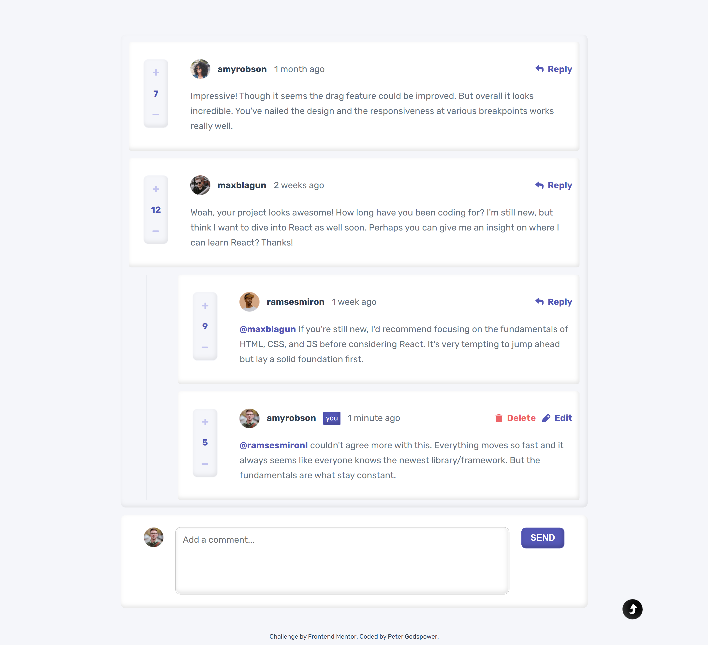
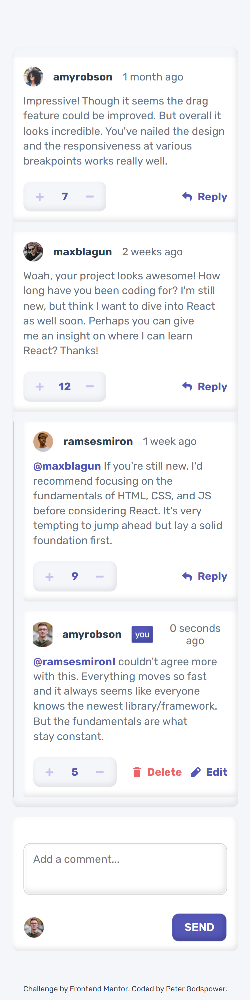

# Frontend Mentor | Interactive Comments Section

This repository contains my solution for the "Interactive Comments Section" challenge on Frontend Mentor. The project involves creating a dynamic comments section that allows users to submit comments, reply to others, and edit or delete their submissions.

## Table of Contents

- [Overview](#overview)
  - [Screenshot](#screenshot)
  - [Links](#links)
- [My Process](#my-process)
  - [Built With](#built-with)
  - [Features](#features)
  - [JavaScript Functionality](#javascript-functionality)
  - [What I Learned](#what-i-learned)
  - [Continued Development](#continued-development)
  - [Useful Resources](#useful-resources)
- [Author](#author)
- [Acknowledgments](#acknowledgments)

## Overview

### Screenshot

### Links

- Solution URL: [Frontend Mentor Solution](https://www.frontendmentor.io/solutions/your-solution-url)
- Live Site URL: [Live Demo](https://your-github-username.github.io/your-repo-name)

## My Process

This project focuses on building an interactive comments section that allows users to engage with one another through comments and replies. The design is clean and responsive, ensuring a seamless experience across devices.

### Built With

- **Semantic HTML5 Markup:** Utilized semantic elements for improved accessibility and SEO.
- **CSS:** Used custom properties for consistent styling, Flexbox for layout, and responsive design techniques.
- **JavaScript:** Implemented dynamic interactions, DOM manipulation, and data handling to enhance user engagement.

### Features

- **Comment Submission:** Users can enter and submit new comments.
- **Reply Functionality:** Users can reply to existing comments with ease.
- **Edit and Delete Options:** Users can edit or delete their own comments.
- **Dynamic Rendering:** Comments and replies update in real-time without page refresh.
- **User State Management:** Utilizes a state management system to keep track of user interactions.

### JavaScript Functionality

The project includes multiple JavaScript files that handle core functionality. Key components include:

- **Input Handling:** Listens for changes in comment input and manages submission.
- **Dynamic Updates:** Updates the displayed comments and replies in real-time based on user actions.
- **Error Handling:** Provides user-friendly messages for invalid inputs (e.g., when a comment is too short).
- **Debouncing:** Implements debouncing for improved performance on rapid user interactions.

### Flow Carts

Project Overview Flow

Description: This flow chart outlines the main components of the application, from initialization through to user interactions and comment management. It highlights how user actions trigger various scripts that manage comment functionality and UI updates, ensuring a responsive experience.

<!-- prettier-ignore -->
START
|
|---> Initialize Controller
|     |
|     |---> Initialize DOM
|     |     |
|     |     |---> Load User State (Script: loadUserState())
|     |     |---> Initialize Observers (Script: handleMutation())
|     |     |---> Initialize Markup (Script: updateUi())
|     |           |
|     |           |---> Insert User Data (Script: getData(data))
|     |           |---> Insert Comments (Script: getData(data))
|     |           |---> Initialize User States in Map (Script: _fetchData())
|     |
|     |---> Set Up Event Listeners
|           |
|           |---> Click Event
|           |     |
|           |     |---> Identify Action
|           |     |     |
|           |     |     |---> Increment (Script: isIncreased(e))
|           |     |     |---> Decrement (Script: isReduced(e))
|           |     |     |---> Reply (Script: handleReplyComment(e))
|           |     |     |---> Delete (Script: handleConfirmDelete())
|           |     |     |---> Edit (Script: handleEditComment(e))
|           |     |     |---> Cancel (Script: _clearTextArea())
|           |     |     |---> Send (Script: handleSendComment(e))
|           |     |     |---> Confirm Delete (Script: handleConfirmDelete())
|           |     |     |---> (Default)
|           |
|           |---> Key Event
|           |     |
|           |     |---> Identify Action (similar to Click Event)
|           |
|           |---> Input Event
|                 |
|                 |---> Update Comment Text Area (Script: handleInsertComment(value, reply))
|
|---> Handle Comment Management
|     |
|     |---> Insert User Comment
|     |     |
|     |     |---> Check if Comment is Approved (Script: _isValidComment(comment))
|     |     |---> If Reply, Insert into Reply Section (Script: _removeDuplicateReply())
|     |     |---> If New Comment, Insert into Comment Section (Script: handleNewCommentUpdate())
|     |
|     |---> Handle Edit or Send Comment
|           |
|           |---> Check for Active Edit (Script: _removeDuplicateEdit())
|           |---> If Active Edit, Update Comment (Script: handleEditComment(e))
|           |---> If Not, Send New Comment (Script: handleSendComment(e))
|
|---> Utilize Index Class for Date and Time Handling
|     |
|     |---> Format timestamps and update UI
|     |     |
|     |     |---> Update Current Time in UI Elements (Index: updateCurrentTime(element, initialTimeStamp))
|     |     |---> Start/Stop Time Updates as Needed (Index: startUpdatingCurrentTime())
|     |
|     |---> Generate Markup for Comments
|           |
|           |---> Create Markup for Parent Comments (Index: markupParent(comment))
|           |---> Create Markup for User Inputs (Index: markupUser(data))
|           |---> Create Markup for User Cards (Index: markupUserCard(data, comment, oldComment))
|           |---> Handle Insertion of Generated Markup into DOM (Index: handleCardMarkup())
|
|---> Mutation Observers
|     |
|     |---> Monitor DOM Changes (Script: handleObservePopUp())
|     |
|     |---> Update UI in Real-time Based on Changes (Script: updateUi(userId))
|
END

<!-- prettier-ignore  -->
+-------------------+       +-------------------+       +------------------+
|     Script Class  | ----> |     Controller    | <---- |     Index Class   |
+-------------------+       +-------------------+       +------------------+
|                   |       |                   |       |                  |
|---> Load User     |       |---> Initialize DOM|       |---> Update Time UI |
|     State         |       |     Function:     |       |     (updateCurrentTime())|
|     Function:     |       |     updateUi()    |       |                  |
|     loadUserState()|      |                   |       |---> Generate Markup |
|                   |       |---> Set Up Event  |       |     Functions:    |
|---> Initialize    |       |     Listeners     |       |     markupParent(comment)|
|     Observers     |       |     Functions:    |       |     markupUser(data)|
|     Function:     |       |     identifyAction(e) |   |     markupUserCard(data, comment, oldComment)|
|     handleMutation()|     |     (handles click,|       |     handleCardMarkup()|
|                   |       |     key, input events)|   |                  |
|---> Handle Actions |       |                   |       |                  |
|     Functions:    |       |---> Handle Comment |       |                  |
|     isIncreased(e)|       |     Management     |       |                  |
|     handleSendComment(e)| |     Functions:     |       |                  |
|     handleReplyComment(e)| |     handleNewCommentUpdate()|                 |
|     handleConfirmDelete()| |     _removeDuplicateReply()|                  |
|     handleEditComment(e)| |     _removeDuplicateEdit()|                   |
|     _clearTextArea()|     |                   |       |                  |
|                   |       +-------------------+       +------------------+
+-------------------+

### What I Learned

Through this project, I enhanced my skills in:

- **Dynamic UI Interactions:** Understanding how to manage state and dynamically update the DOM.
- **Event Handling:** Effectively managing user events to create a responsive user interface.
- **Responsive Design:** Creating layouts that adapt seamlessly to various screen sizes using CSS Flexbox.
- **Accessibility Best Practices:** Ensuring all interactive elements are accessible to all users.

### Continued Development

Future updates may include:

- **User Authentication:** Allowing users to log in and manage their comments.
- **Improved Styling:** Adding more advanced styling and animations to enhance the user experience.
- **Enhanced Features:** Implementing features like comment sorting or filtering.

### Useful Resources

- [MDN Web Docs](https://developer.mozilla.org/en-US/) - Comprehensive documentation for web technologies.
- [CSS-Tricks](https://css-tricks.com/) - Articles and tutorials on modern CSS techniques.
- [JavaScript.info](https://javascript.info/) - In-depth JavaScript tutorials and guides.
- [Frontend Mentor](https://www.frontendmentor.io/) - Platform for frontend challenges and community feedback.

## Author

- **Frontend Mentor:** [@YourUsername](https://www.frontendmentor.io/profile/@YourUsername)
- **GitHub:** [@YourUsername](https://github.com/YourUsername)

## Acknowledgments

A special thanks to Frontend Mentor for providing this challenging project and to the community for their valuable feedback and support throughout the development process.
